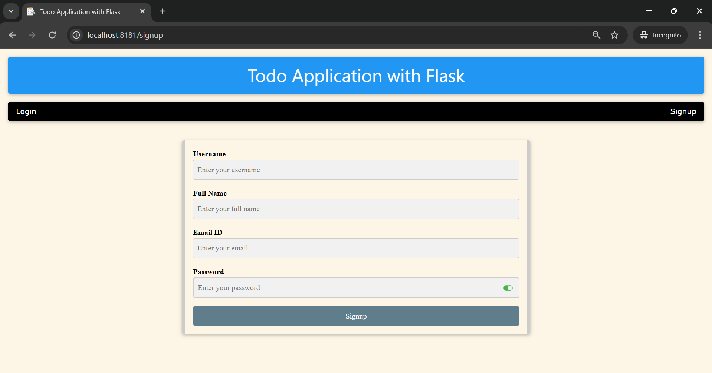
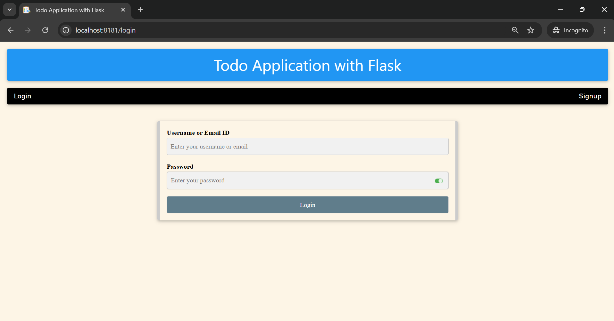
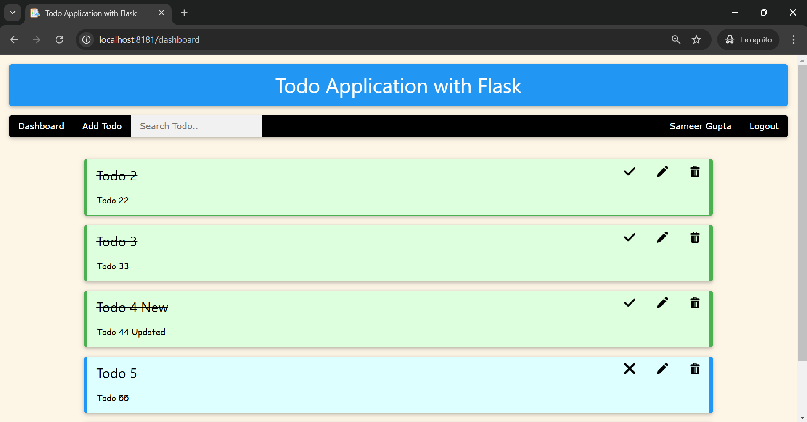
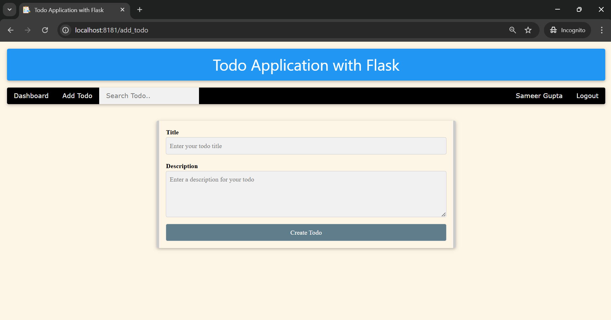
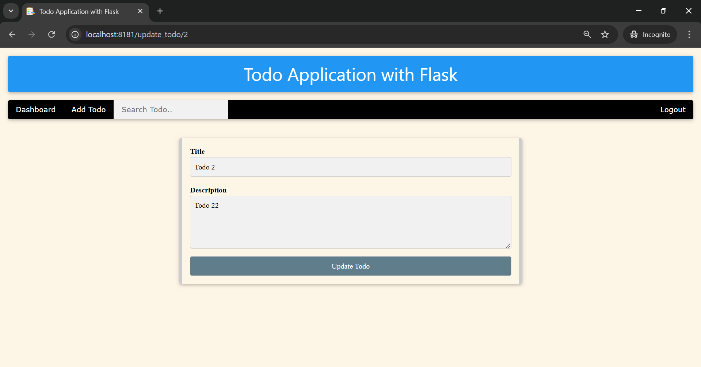
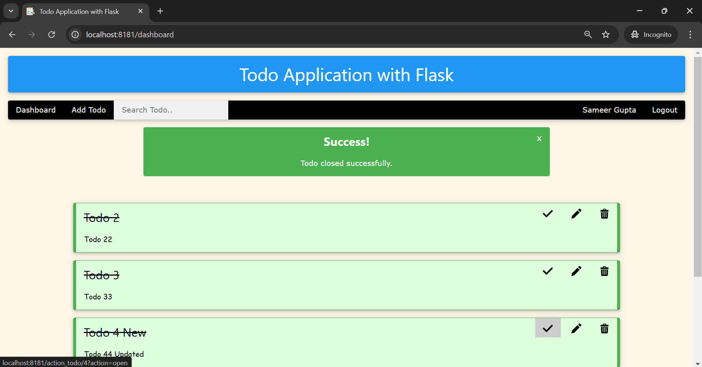
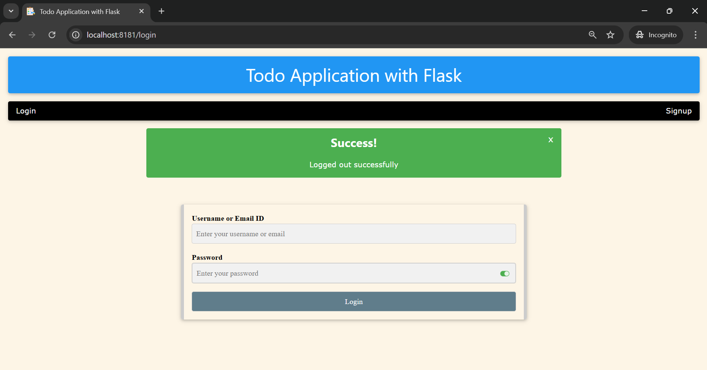

# User-Based Todo Application

A simple Todo web application built using **Flask** and **SQLAlchemy** for managing user authentication, Todo tasks, and user session management. The app uses **JWT-based authentication**, **password hashing with bcrypt**, and **secure cookie storage** for session management.

---

## Table of Contents
1. [Features](#features)
2. [Technologies Used](#technologies-used)
3. [Setup and Installation](#setup-and-installation)
4. [Usage](#usage)
5. [Security](#security)

---

## Features

- **User Authentication**:
  - Signup and login with username or email.
  - Password hashing with **bcrypt** for secure authentication.
  - JWT-based **access tokens** and **refresh tokens** for session management.
  - Secure cookies for storing JWT tokens with `httponly`, `secure`, and `SameSite` attributes.

- **Todo Management**:
  - Create, update, mark as done, and delete Todo items.
  - Display Todos specific to authenticated users.
  - Mark Todos as "done" or "not done".

- **Session & Cookie Management**:
  - User sessions are managed using **Flask Session**
  - **JWT tokens** are managed using **secure cookies** with the `httponly` and `secure` flags to protect against XSS and CSRF attacks.
  - Tokens are automatically validated for every protected route using a `session_token_required` decorator.
  - The user’s session and cookies are validated before accessing protected routes. This ensures the user stays authenticated while accessing protected routes.
  - The user’s session and cookies are cleared when the user logs out.

---

## Technologies Used

- **Flask**: Web framework for building the application.
- **SQLAlchemy**: ORM for database interaction.
- **SQLite**: Database for storing user and Todo data.
- **bcrypt**: Library for password hashing and verification.
- **JWT (JSON Web Tokens)**: For creating and verifying authentication tokens.
- **python-dotenv**: For managing environment variables.
- **Logging**: For error tracking and debugging.

---

## Setup and Installation

### Prerequisites

- Python 3.7+ installed.
- A virtual environment is recommended.

### Installation Steps

1. Clone the repository:

   ```bash
   git clone https://github.com/jeetendra29gupta/User-Based-Todo-Application.git
   cd User-Based-Todo-Application
   ```

2. Create a virtual environment:

   ```bash
   python -m venv venv
   ```

3. Activate the virtual environment:

   - On Windows:

     ```bash
     venv\Scripts\activate
     ```

   - On macOS/Linux:

     ```bash
     source venv/bin/activate
     ```

4. Install dependencies:

   ```bash
   pip install -r requirements.txt
   ```

5. Create a `.env` file in the project root directory to store your environment variables. Example:

   ```env
   SECRET_KEY=your-secret-key
   ALGORITHM=HS256
   ACCESS_TOKEN_EXPIRE_MINUTES=30
   REFRESH_TOKEN_EXPIRE_DAYS=7
   SQLALCHEMY_DATABASE_URL=sqlite:///./todo-app.db
   ```
---

## Usage

1. Run the application:

   ```bash
   python main_app.py
   ```
    > The app will be available at `http://localhost:8181`.
   
2. Available routes:

   - **Signup**: `/signup` - Register a new user.
   
   - **Login**: `/login` - Log in using your username or email.
   
   - **Dashboard**: `/dashboard` - Displays the user's Todo list.
   
   - **Add Todo**: `/add_todo` - Create a new Todo.
   
   - **Update Todo**: `/update_todo/<todo_id>` - Update an existing Todo item.
   
   - **Action Todo**: `/action_todo/<todo_id>` - Mark Todo as done, reopen, or delete it.
   
   - **Logout**: `/logout` - Log out and clear the session.
   

3. The user’s session is managed using **JWT tokens**, stored in **secure cookies**. This ensures the user stays authenticated while accessing protected routes.

---

## Security

- **Password Hashing**: Passwords are securely stored in the database using **bcrypt** hashing.
- **JWT Authentication**: The app uses JWTs for user authentication. Tokens are stored in secure cookies with the `httponly` and `secure` flags to protect against XSS and CSRF attacks.
- **Session Management**: JWT tokens manage user sessions. Tokens are automatically validated for every protected route using a `session_token_required` decorator.

---